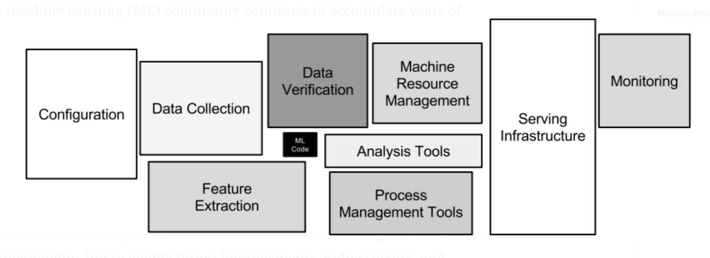

# ML - Engineering Challenge

A linear regression model to predict diabetes.

## Quick Start

1. Setup environment: `make setup-dev`
2. Training: `make train` # Training in a docker container with pwd mounted as a volume
   1. Training on local machine: `make train-local`
3. Serving:
   1. Local:
      1. Build and serve model: `make serve` # Serving in a detached docker container called `linear_regressor`
      2. Get predictions
            1. `/batch`

                ```bash
                curl --location --request POST '0.0.0.0:5000/batch' \
                --header 'Content-Type: application/json' \
                --data-raw '{
                          "instances": [
                              [0.077863387626902],
                              [-0.0396181284261162],
                              [0.0110390390462862]
                            ]
                }'
                ```

            2. `/stream`

                ```bash
                curl --location --request POST '0.0.0.0:5000/stream' \
                --header 'Content-Type: application/json' \
                --data-raw '{
                          "instance": 0.0110390390462862
                }'
                ```

      3. Other Available endpoints:

           ```bash
           curl --location --request GET '0.0.0.0:5000/'
           ```

           ```bash
           curl --location --request GET '0.0.0.0:5000/ping'
           ```

      4. Stop server: `make server-stop-cleam`

   2. On Google Cloud Run: I am deploying the server as a service on Google Cloud run (see `./.github/workflows/service.yml`). So it can be accessed by following endpoints: # NOTE - 🚩🚩🚩 Service is currently unauthenticated for demo purposes, should never be deployed like this ever!  🚩🚩🚩

        ```bash
                curl --location --request POST 'https://linear-regressor-server-potyyknnfq-km.a.run.app/batch' \
                --header 'Content-Type: application/json' \
                --data-raw '{
                          "instances": [
                              [0.077863387626902],
                              [-0.0396181284261162],
                              [0.0110390390462862]
                            ]
                }'
        ```

        ```bash
                curl --location --request POST 'https://linear-regressor-server-potyyknnfq-km.a.run.app/stream' \
                --header 'Content-Type: application/json' \
                --data-raw '{
                          "instance": 0.0110390390462862
                }'
        ```

        ```bash
           curl --location --request GET 'https://linear-regressor-server-potyyknnfq-km.a.run.app/'
        ```

        ```bash
        curl --location --request GET 'https://linear-regressor-server-potyyknnfq-km.a.run.app/ping'
        ```

4. Test: `make test-local-docker`. Tests for type hinting, lint, security vulnerabilites, unit tests, server build and test. Note: unit test only written for a few functions to demonstrating testing, skipped for the rest in the interest of time as this is only a demo.

## Repo

Repo Structure

```bash
•••• tree
.
├── Makefile                                            <- Makefile for common operations
├── Pipfile                                             <- Pipfile for dependencies
├── Pipfile.lock
├── README.md                                          <- README for this repo (this file)
├── assests                                            <- assests, useful images, cachable artefacts etc..
│   ├── google-cloud-sdk-373.0.0-linux-x86_64.tar.gz
│   ├── img.png
│   └── mlsys.png
├── benchmark.py                                       <- benchmark.py for benchmarking
├── builder.Dockerfile                                  <- Docker container image with dev environment loaded
├── dev                                                <- Scripts helpful during tdd, for watching dir & auto running tests
│   ├── test.sh
│   └── watch_test.sh
├── linear_regressor                                   <- Linear regressor python package
│   ├── __init__.py
│   ├── api.py                                         <- api.py for serving
│   ├── linear_regressor.py                            <- module w/ Model class and functions
│   ├── predict.py                                     <- module to get predictions for serving
│   ├── server.py                                      <- Server module for starting the server (gunicorn or flask)
│   └── utils.py                                       <- Utility functions used in the package
├── logging_config.ini                                  <- Logging configuration file
├── main.py                                            <- CLI / Application entry point
├── models
│   └── simple_linear_regressor.joblib                 <- Model saved as a joblib file
├── scripts
│   └── test_local_server.sh                           <- Script for testing server
├── server.Dockerfile                                   <- Docker container image for server
├── setup.cfg                                          <- Setup configuration file
├── setup.py                                           <- Setup script
└── tests                                              <- Unit tests
    ├── __init__.py
    └── test_utils.py
```

## Tasks

Tasks in the challenge:

    - [x] High level overview of your systems design and its key components # not drawing a proper design diagram in the interest of time
       - Serving: Cloud Run -> Server Docker Container -> gunicorm web server -> Flask app -> Simple Linear Regressor Model
    - [x] Create a simple linear regression model
    - [x] An API for inference. Make the API invokable from a http request. The choice of web framework is up to you.
    - [x] Package code into a python package
    - [x] Package code into a container and deploy it to a container registry
    - [x] Create a CICD pipeline
    - [x] Componenets an enterprise machine learning system would have if I had the time to add it
      - E2E pipelines would be orchestrated with an MLOps platform (kubeflow, mlflow, etc..) w/ modular components (for data ingestion, cleaning, verfication, training, evaluations, testing, serving, etc..),metadata tracking, data versioning, artefacts (model, docker image, data snapshots) stored in cloud storage, etc..
      - Extensive tests w/ full unit tests for code, data integrety tests, integrated tests, infrastrcutre tests (w/ something like terraform and drift detection), E2E service test, load tests to test the scaling of the service, etc..
      - Infrastructure provisioned with proper infrastructure as a tool in a declarative fashion
      - Optimized for application performance (training, serving), deployment speed, etc..
      - Better application logging, packing and versioning
      - API spec defined with a standard like OpenAPI (and json schema data models) & versioning
      -  Authentication, authorization, auditing, for the etc..
      - Monitoring and alerting in place for monitoring things like api performance (latency, throughput, etc..), service health, data drift, concept drift, infrastructure drift etc..
      - Some sort of retraining, feedback loop if the situation warrants etc..

---------------------------------------

## Build a machine learning system

Welcome to the endeavour machine learning challenge! This challenge is designed to test a large variety of skills that a machine learning engineer would use in their day to day work. There are no restrictions in terms of technology required for this challenge other than the use of Python 3. You are free to use whichever technology or cloud provider you like. It's important to note that everyone has strong points and weak points. If you are strong in one or more areas, try to make that area shine.

The challenge description is as follows:

#### 0. Take the code provided and upload it to a git repository of your choice

After you complete the challenge, please add our team members as viewers to your repo.

#### 1. Please provide a high level overview of your systems design and its key components

This could be a one pager, a readme.md or an architecture diagram. We will leave the implementation up to you.

#### 2. Create a simple linear regression model

You will have to fill in the gaps in the `SimpleLinearRegression` class so that the code will run successfully.

The following functions need to be filled:

- `__loss`: This function defines the loss function of your choice.
- `__sgd`: We will use the Stochastic Gradient Descent Algorithm to optimise the slope and the intercept of our linear function. There are many resources online about SGD, However
the most important formulas are :


Where `n`is the number of sample in the training dataset.

Do your best to vectorize the formulas.

- `__predict`our linear function to predict the outcome. The function of a simple line is defined as `y= wX + b`

We have provided the benchmark code `benchmark.py`. Execute it and you should get the Coefficient of determination around `0.42`.
A good implementation should return about the same Coefficient of determination or slightly higher. During the interview we could explore the time and memory complexity of your code.

**PS: If you are struggling implementing the above, consider using scikit-learn to progress to the next stages (but this is not encouraged).**

3. Update `main.py` to make it an API for inference. Make the API invokable from a http request. The choice of web framework is up to you.

The API should have two endpoints:

- `POST /stream` : which takes a payload of one record and return the prediction for that record.
- `POST /batch` : which takes an array of multiple records and return an array of predictions

Think about what other features an enterprise machine learning system would have.

#### 4. Package your code into a python package to make it easily installable and testable for developers

#### 5. Package your code into a container and deploy it to a container registry of your choice

#### 6. Create a CICD pipeline using the technology of your choice to deploy your code to production

Think about what stages might be required in a full CICD pipeline. Your code should be invokable from a public URL.

#### 7. Document what componenets an enterprise machine learning system would have if you had the time to add it

What are some things that are critical to have versus nice to have?

## Assessment Criterion

We are not looking for a highly performant model. The criterion for this exercise is centered on a complete system that works well together and your ability to apply a machine learning inference to a real world use case. The following diagram speaks volumes about the reality of a machine learning engineer.



We are more interested in how your overall system works and the ancillary systems and components that are considered and better yet, implemented. As you complete the challenge, try to think about the following assessment criterion:

- Does your solution work end to end?
- Are there any unit tests or integration tests?
- Has security/monitoring been considered?
- How is your solution documented? Is it easy to build on and for other developers to understand
- How performant is your solution both from a code perspective and a scalability perspective as a service
- Has due consideration been given to what a production ML system would require? This could be interactions or dependencies with other systems.

Good luck & have fun!
